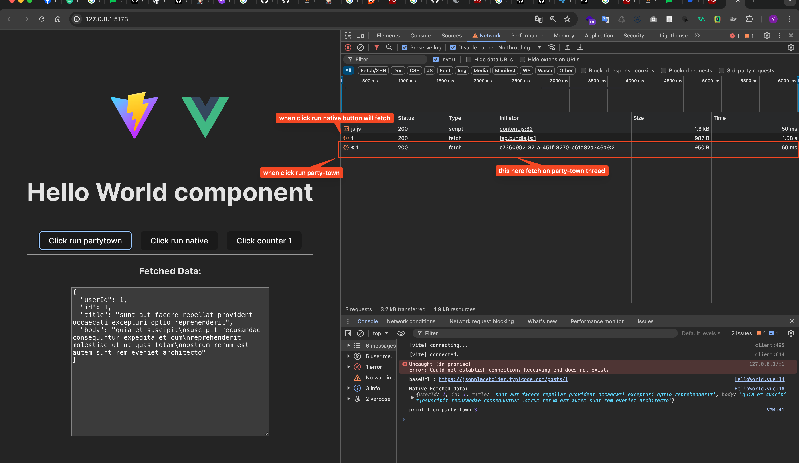

# Vue 3 + Vite + Partytown

I tried to poc with usecase party-town library with incase fetch-api then send reponse to vue state

- [X] Consider detail code on HelloWorld.vue




## How to run
```sh
npm run dev # run dev mode
npm run build # build to dist
serve -s dist -l 8080 # run after build
```